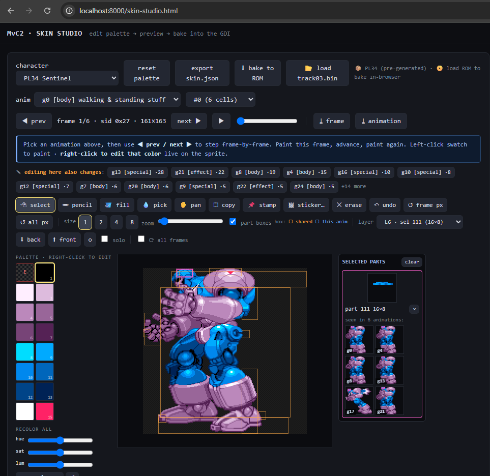

# MvC2 Skin Studio

Edit **Marvel vs. Capcom 2** character sprites — recolor the palette **and paint the
pixels** — then **bake them straight into your own GDI** to play on flycast or a real
Dreamcast (GDEMU / burned disc). Everything runs locally in your browser; your ROM is
never uploaded.



> **BYOR — Bring Your Own ROM.** This repo contains **no game data**. You supply your
> own legally-owned MVC2 disc. All sprite data is decoded *from your copy* into local,
> git-ignored files. Don't commit ROMs, extracted sprites, or baked discs.

---

## What it does

- **Palette editor** — recolor any of a character's 16 colors; see it live on the sprite.
  Plus **recolor-all** (shift hue / saturation / luminance of the whole palette at once)
  and **swap N→M** (repaint every pixel of one color index to another, across all parts).
- **Pixel editor** — pick an animation, step frame-by-frame, and paint on the fully
  assembled sprite. Tools: **select** (default — click to inspect a part, never paints),
  pencil, fill, pick, pan, brush sizes, undo, per-part boxes, layer order (send back /
  bring front).
- **Copy / paste / stickers** — marquee-**copy** a region and **stamp** it elsewhere, or
  import any PNG as a **sticker** (auto-quantized to the character's palette) and stamp it.
- **Edit in bulk** — every part is shared, so painting a part updates *every* frame that
  reuses it automatically. On top of that:
  - **⟳ all frames** applies a stroke/fill/stamp to the same spot across the whole animation
    (great for a chest logo or a facial mark); **top-anchor** maps it relative to the sprite's
    top-center so it tracks a head as the body bobs.
  - **▣ region** tool — drag a box over a feature (e.g. the head), like the copy marquee, and
    it selects that feature's parts across *every frame* of the animation so you can edit it
    everywhere. (One-click 🙂 head / 👕 torso / 🦵 legs buttons give a coarse quick-select.)
  - **↪ propagate edit** applies the part you just edited onto the other selected parts that
    match it — handy for the near-duplicate frames of a feature.
  - An **impact view** color-codes which parts are shared with other animations (amber) vs
    unique to this one (blue), so you always know what an edit will affect.
- **One-click bake** — writes the edited sprite back into `track03.bin` *in place*, with
  an automatic pristine `track03.bin.bak` made the first time (so you can always undo).
- **Pixel-art bridge** — export parts/frames/animations as PNGs, edit in Aseprite/GIMP/
  Piskel, bake back.

It works because MVC2 stores each character in a `PLxx_DAT.BIN` file inside the disc:
a table of **GFX1** parts (4bpp-indexed, twiddled, LZSS-compressed pixels), a **GFX2**
assembly table (which parts compose each sprite + where), a **palette**, and animation
data. Skin Studio decodes those, lets you edit, re-compresses, and rewrites the file —
fixing the disc's ISO sizes so the game still boots.

---

## Quick start

### 0. Prerequisites
- **Python 3.8+** and **Pillow** (`pip install -r requirements.txt`)
- **Chrome or Edge** (the in-browser bake uses the File System Access API; Firefox/Safari
  fall back to a server bake — see below)
- Your **MVC2 GDI**, extracted to a folder as separate tracks
  (`track01.bin`, `track03.bin`, `*.gdi`). `track03.bin` is the data track Skin Studio reads.

### 1. Point the tools at your ROM folder
```bash
# macOS/Linux
export MVC2_ROM_DIR=/path/to/your/mvc2_gdi_folder
# Windows (PowerShell)
$env:MVC2_ROM_DIR = "C:\roms\mvc2_us"
```
(Default if unset: `C:\roms\mvc2_us`.)

### 2. Decode your character data (one command)
```bash
pip install -r requirements.txt
python tools/build_skin_studio_data.py "$MVC2_ROM_DIR/track03.bin" --out web/test-atlas/chars
```
This decodes every character into `web/test-atlas/chars/` (git-ignored) — `PLxx_edit.{png,json}`,
`PLxx_lut.json`, `PLxx_asm.json` — and writes a **one-time pristine `track03.bin.bak`** next to your
ROM, so a backup always exists before any baking (pass `--no-backup` to skip). The **animation
catalogs** in `web/anim/` are already shipped (public metadata, not pixels).

### 3. Run it
```bash
python tools/skin_server.py          # serves web/ + a /bake endpoint on http://localhost:8000
```
Open **http://localhost:8000/skin-studio.html** — it **auto-loads** the character data you just
decoded (sprites + animations appear immediately, no picker). Pick a character, recolor / paint,
then **⬇ bake to ROM**.

> Serve over **http://localhost** (a secure context). Opening the `.html` file directly
> (`file://`) won't work.

*(Optional: **📂 load track03.bin** loads a character live from the ROM instead of the
pre-generated files — and is what enables the in-browser bake on Chrome/Edge.)*

---

## Baking — how it writes to your disc (and how to undo)

The bake **edits `track03.bin` in place**. A pristine **`track03.bin.bak`** is created up front by
the extract step (Step 2), so a backup always exists. Two ways to bake:

- **Server bake (default, any browser):** with `skin_server.py` running, **⬇ bake to ROM** sends the
  edit to the local Python server, which patches `track03.bin` in place (and makes the `.bak` if one
  isn't there). Nothing is uploaded; your ROM never leaves your disk.
- **In-browser bake (Chrome / Edge, no server):** click **📂 load track03.bin**, then **⬇ bake to
  ROM** — the page writes the sectors directly via the File System Access API. (A browser file handle
  can't create a sibling `.bak`, so this relies on the Step-2 backup.)

**To undo:** delete the edited `track03.bin` and rename `track03.bin.bak` back to it.

Edits that re-compress *larger* than the original are handled: the tool grows the sprite
file into the disc's sector slack and patches the ISO directory sizes. If an edit needs
more room than the slack allows, it's refused (simplify the edit — fewer colors / more
transparency — or a full disc repack would be required).

> Keep a copy of your ROM folder somewhere safe, and close the game in flycast before
> baking. CLI equivalent: `python tools/bake_skin.py skin.json` bakes in place (+ `.bak`);
> add an output dir — `python tools/bake_skin.py skin.json OUT_DIR` — to write a patched
> **copy** there instead and leave the source untouched.

---

## How the pieces fit

```
your track03.bin ─► build_skin_studio_data.py ─► web/test-atlas/chars/PLxx_*  ─┐
                                                                               ├─► browser editor (skin-studio.html)
                              web/anim/PLxx.json (shipped animation catalogs) ─┘        │ edit palette + pixels
                                                                                        ▼
                                                          bake (rom-bake.mjs / bake_skin.py)
                                                                                        ▼
                                                       patched track03.bin  ─►  flycast / Dreamcast
```

---

## Tools reference

### Browser app (`web/`)
| File | What it does |
|------|--------------|
| `skin-studio.html` | The page. Loads the editor module and shows the bake instructions. |
| `panels/tile-editor.mjs` | The whole editor UI — palette swatches, animation/frame stepper, the composite-frame pixel canvas, load-ROM (folder pick), and the bake button. |
| `rom-reader.mjs` | Reads a character out of a GDI **in the browser** — finds `track03.bin` in your folder, locates `PLxx_DAT`, decodes parts + palette + assembly + animations into the shapes the editor expects. |
| `rom-bake.mjs` | The browser bake engine — LZSS encode/decode, twiddle/detwiddle, GFX1 offset-table rebuild (with grow), palette patch, in-place sector writes + ISO size patch, post-write verification, and the `.bak` backup. Byte-for-byte equivalent to the Python pipeline. |
| `anim/PLxx.json` | Per-character animation catalogs (sprite-id + duration metadata). Public data — shipped with the repo. |

### Python pipeline (`tools/`)
| File | What it does |
|------|--------------|
| `gfx1_lzss.py` | The MVC2 GFX1 **LZSS codec** (`decodeA` / `encodeA`). The encoder is tuned to match the game's own token distribution so the real hardware decoder never chokes. |
| `extract_gfx1_atlas.py` | PVR **PAL4 twiddle/detwiddle** + palette helpers; can dump a character's parts to a packed atlas PNG. |
| `rebuild_gfx1.py` | The core **DAT rebuilder** — re-lays-out a character's GFX1 parts, rewrites the offset table, preserves unedited parts byte-exact, and grows the file (shifting later sections + bumping **all** header pointers) when an edit needs more room. Also locates a `PLxx_DAT` inside a track (`find_dat`/`find_dat_full`). Reads `MVC2_ROM_DIR`. |
| `part_png.py` | **Indexed-PNG bridge** — export sprite parts as indexed PNGs (the character's 16 colors, index 0 = transparent) and convert edited PNGs back to twiddled 4bpp blobs. |
| `build_skin_studio_data.py` | **Run this once per ROM.** Generates all the editor data (`PLxx_edit/_lut/_asm`) for every character from your `track03.bin`. |
| `export_editor_bundle.py` | Builds one character's `PLxx_edit.{png,json}` bundle (the bake-faithful part atlas the painter uses). Called by `build_skin_studio_data.py`; runnable standalone for a single char. |
| `bake_skin.py` | The **server/CLI bake**. Takes a `skin.json` (palette edits + pixel/part overrides) and edits `track03.bin` **in place** after a one-time `track03.bin.bak` (or writes a patched copy if you pass an output dir). Used by `skin_server.py`. |
| `skin_server.py` | The local **dev server** — serves `web/` and accepts `POST /bake` so the editor can bake via Python (the in-place + `.bak` fallback for non-Chromium browsers). |
| `build_anim_catalog.py` | Regenerates `web/anim/PLxx.json` from the public anotak corpus. The catalogs are already shipped; you only need this to rebuild them (requires the anotak cache). |
| `diag_baked_rom.py` | **Diagnostic.** Diffs a baked `track03.bin` against its `.bak`, finds which character changed, and strictly re-validates every sprite part the way the real SH4 decoder reads it — flags anything that would corrupt on hardware. |

### `skin.json` (for the CLI / pixel-art bridge)
```json
{
  "char": "PL17",
  "palette":   { "0": { "3": [255, 0, 0, 255] } },          // bank → index → [r,g,b,a]
  "parts_png": { "198": "edit/PL17_sel198.png" }            // sprite part (sel) → edited indexed PNG
}
```
```bash
python tools/bake_skin.py myskin.json            # → patched GDI copy
```

---

## Troubleshooting

| Symptom | Fix |
|--------|-----|
| `❌ Don't open this file directly` | Serve over `http://localhost` (`python tools/skin_server.py`), not `file://`. |
| File picker missing / `getFile not allowed` | Use Chrome/Edge over `http://localhost`; or use the Python server bake. |
| Painter is empty for a character | Run `build_skin_studio_data.py` (step 2) so its `PLxx_edit` bundle exists. |
| Bake refused: "needs more bytes than slack" | The edit re-compresses too large — use fewer colors / more transparent pixels. |
| Console crash on non-ASCII (`UnicodeEncodeError`) | Windows cp1252 console — the tools force UTF-8; if you see it, run with `set PYTHONUTF8=1`. |
| An animation "sticks on its last frame until you move" | Usually **not your edit** — many MVC2 moves hold their recovery pose until you input. Confirm by doing the same on the **unedited** ROM. |
| Game genuinely crashes after a bake | Restore from `track03.bin.bak` and re-bake. Run `python tools/diag_baked_rom.py <track03.bin>` to validate (it strict-decodes every part the way the SH4 does). |

---

## Editing notes & gotchas

- **Editing never changes game logic.** You only touch sprite *pixels* — recolor, paint, or fully erase parts freely. Even a 100%-transparent (fully-erased) part is safe; the engine handles empty parts fine.
- **Parts can be shared across animations — and the editor shows you.** A given part (sel) may appear in several animations, so editing it changes *every* animation that uses it. Part boxes are color-coded: **amber** = shared with other animations (an edit ripples out), **blue** = unique to this animation (safe). The line above the canvas (**"✎ editing here also changes…"**) lists exactly which animations share parts with the current one — click a chip to *preview* it without leaving your place. There are two ways an edit carries across an animation: (1) automatically, to every frame that reuses the *same part*; (2) via the **⟳ all frames** toggle, which applies the edit to the same on-screen *position* on every frame (best for stationary features — it maps by screen position, so it's only approximate when the body moves a lot).
- **Dimensions are preserved.** The bake never changes a part's width/height — the engine derives its decode size and on-screen footprint from them. Repaint within the existing part box.
- **Validate any patched track** with `python tools/diag_baked_rom.py <track03.bin> [<track03.bin.bak>]` — it diffs against the backup and strict-decodes every part exactly as the SH4 decoder does, flagging anything that would misbehave on hardware.

---

## Credits & acknowledgments

Skin Studio stands entirely on the shoulders of the Marvel vs. Capcom 2 reverse-engineering
community. None of this would exist without their decades of work:

- **anotak** — the multi-year, near-complete reverse engineering of MvC2's system and data.
  Skin Studio's animation catalogs (`web/anim/PLxx.json`: groups → sub-animations → cells →
  sprite-ids) are built from the public **anotak** data corpus.
  → [anotak data (mirror)](https://zachd.com/mvc2/data/anotak/)
- **mountainmanjed — `marvelous2`** — the hand-labeled SH4 disassembly of MvC2 (NTSC-U). It's
  the ground truth for the `PLxx_DAT` sprite format used here: the **GFX1** (LZSS-compressed,
  twiddled 4bpp parts) and **GFX2** assembly records (`[dx][dy][flags][sel]`), the mirror
  flags (`0x4000` X / `0x8000` Y), and the per-part draw order (engine depth `Z = 1/W`,
  first-submitted = front) that the editor's layering matches.
  → [github.com/mountainmanjed/marvelous2](https://github.com/mountainmanjed/marvelous2)
- **Preppy** — for collecting and preserving the enormous body of MvC2 art and information over
  the years, the *MvC2: Deconstructed* breakdown of the Dreamcast disc, and **PalMod** — the
  long-running palette editor for Capcom fighters (MvC2 included; originally by DrewDos,
  Magnetro, eidrian & Preppy). Skin Studio doesn't use PalMod's code or data — it decodes
  palettes straight from your ROM — but PalMod is the prior art that proved out community
  palette editing for these games.
  → [zachd.com/mvc2](https://zachd.com/mvc2/) · [MvC2: Deconstructed](https://zachd.com/mvc2/resources/mvc2/) · [PalMod](https://github.com/Preppy/PalMod)

If you contributed MvC2 RE that's reflected here and want different wording or a link, open an
issue — credit is owed and gladly corrected.

---

## Legal

MvC2 and all Dreamcast/Naomi game data are copyrighted by their owners. This project ships
**no** game data and is for use with a disc **you legally own**. Don't distribute ROMs,
extracted sprites, or baked discs.
